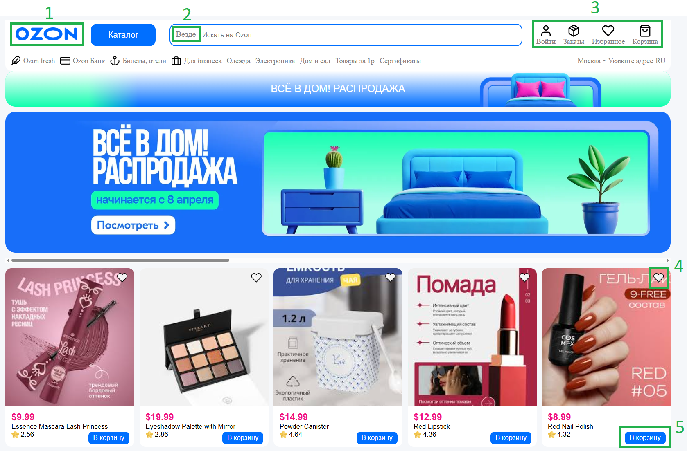
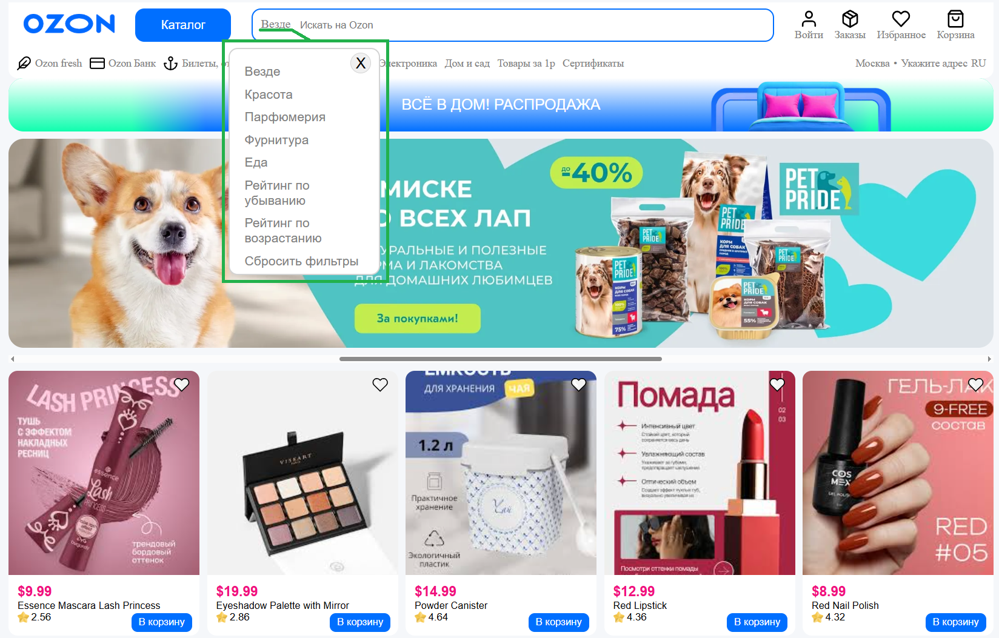
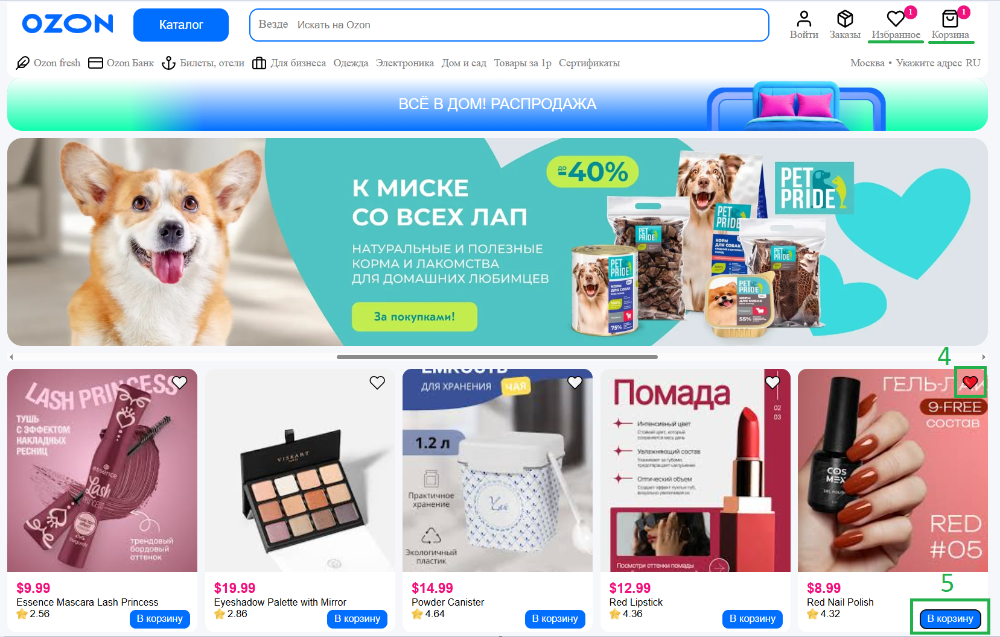
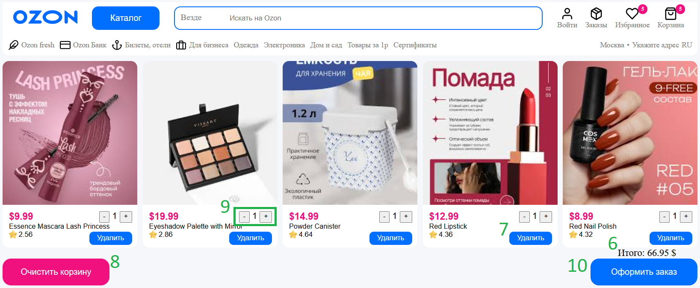
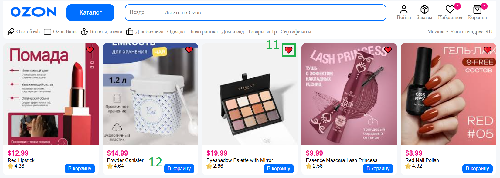
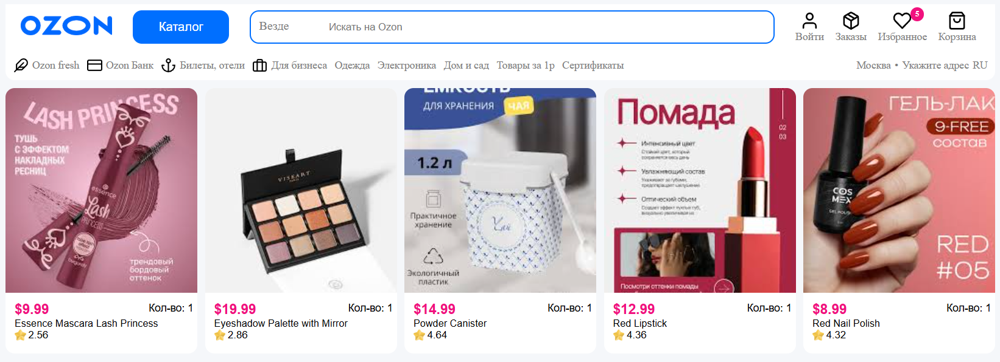
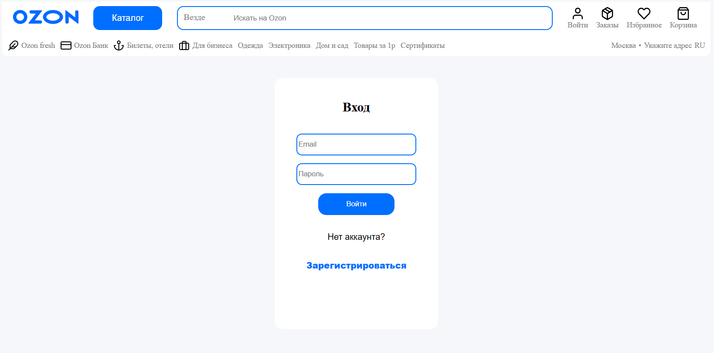
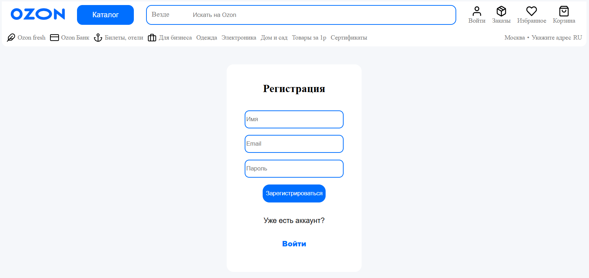

#  Клон маркетплейса (Marketplace Clone)

[](https://reactjs.org/)
[](https://reactrouter.com/)
[](https://vitejs.dev/)
[](https://opensource.org/licenses/MIT)

**Одностраничное приложение (SPA) интернет-магазина**, демонстрирующее ключевые навыки фронтенд-разработки: компонентный подход, управление состоянием, маршрутизацию, авторизацию и оптимизацию.

 **Живое демо:** [https://nlysiakov.github.io/my-first-project](https://nlysiakov.github.io/my-first-project)

---

##  Оглавление

- [О проекте](#-о-проекте)
- [ Стек технологий](#-стек-технологий)
- [ Реализованный функционал](#-реализованный-функционал)
- [ Демонстрация](#-демонстрация)
- [ Быстрый старт](#-быстрый-старт)
- [ Структура проекта](#-структура-проекта)
- [ Как внести вклад](#-как-внести-вклад)
- [ Лицензия](#-лицензия)

---

##  О проекте

Этот проект — моя полноценная работа на React, созданная для демонстрации технических навыков при поиске работы Junior Frontend Developer. Здесь я постарался реализовать логику, максимально приближенную к реальным интернет-магазинам: от каталога товаров до оформления "заказа".

**Основная цель:** Показать понимание хуков, контекста, работы с API и построения маршрутизации в современном React-приложении.

---

##  Стек технологий

Проект построен на актуальном инструментарии, чтобы показать знакомство с современным фронтенд-миром:

*   **Ядро:** React 18
*   **Маршрутизация:** React Router DOM v6
*   **Управление состоянием:** React Context API (для корзины, избранного, авторизации)
*   **Сборка и сервер разработки:** Vite
*   **HTTP-запросы:** Fetch API / Axios
*   **Стилизация:** CSS Modules
*   **Работа с Git:** Ветвление (`feature-branch`), осмысленные коммиты

---

##  Реализованный функционал

Проект включает в себя все ключевые элементы электронной коммерции:

*   **Каталог товаров:**
    *   Загрузка и отображение карточек товаров с реального REST API (dummyjson.com).
    *   **Адаптивная верстка:** Корректно отображается на любых устройствах.
*   **Поиск и фильтрация:**
    *   **Debounced поиск:** Запрос на сервер отправляется **только через 400 мс после остановки ввода**, что снижает нагрузку и имитирует поведение реальных маркетплейсов (таких как Ozon).
*   **Корзина:**
    *   Добавление/удаление товаров, изменение количества.
*   **Авторизация:**
    *   Реализована базовая "демо"-авторизация с проверкой данных.
    *   Контекст авторизации контролирует доступ к корзине и профилю.
*   **Маршрутизация:**
    *   Реализованы все основные страницы: Главная, Каталог, Корзина, Избранное, Авторизация.

---

##  Демонстрация

Ниже представлен внешний вид и ключевые сценарии работы приложения.

1. Главная страница - зеленым цветом выделены функциональные элементы сайта. А также всегда можно вернуться на главную, нажав на логотип (1).
2. Панель фильтров - при нажатии на кнопку (2) - открывается сайдбар с фильтрацией и сортировкой по рейтингу.
3. Добавление в корзину/избранное - реализовано через функциональные кнопки (4) и (5) на карточках товаров, при добавлении также отображается кол-во добавленных товаров.
4. Корзина -  реализован функционал: подсчета суммы товара (6), удаления на кнопку (7), очистить корзину (8), изменение кол-ва товаров (9) и оформление заказа через кнопку (10), после чего товары из корзины попадают в "Заказы".
5. Избранное - функционал: удалить (11), добавить в корзину (12).
6. Заказы - оформленные заказы из корзины, отображается кол-во каждого заказанного товара.
7. Страница входа - поля для ввода email и пароля, кнопка «Войти», ссылка на страницу регистрации для новых пользователей.
8. Страница регистрации - поля для ввода имени, email и пароля, кнопка «Зарегистрироваться», ссылка на страницу входа для уже зарегистрированных пользователей.

<details>
<summary><b>📸 Посмотреть скриншоты</b></summary>


<br/>

| Главная страница | Панель фильтров |
|:----------------:|:-----------------:|
|  |  |

| Добавление в корзину/избранное | Корзина |
|:------:|:----------------:|
|  |  |

| Избранное | Заказы |
|:----------------:|:-----------------:|
|  |  |

| Страница входа | Страница регистрации |
|:------:|:----------------:|
|  |  |

</details>

---

##  Быстрый старт

Следуйте этим шагам, чтобы запустить проект локально.

### Требования
Убедитесь, что у вас установлены **Node.js** (версия 16 или выше) и **Git**.

### Установка и запуск

1.  **Склонируйте репозиторий:**
    ```bash
    git clone https://github.com/nlysiakov/my-first-project.git
    cd my-first-project
2.  **Установите зависимости:**
    ```bash
    npm install
3.  **Запустите сервер для разработки:**
    ```bash
    npm run dev